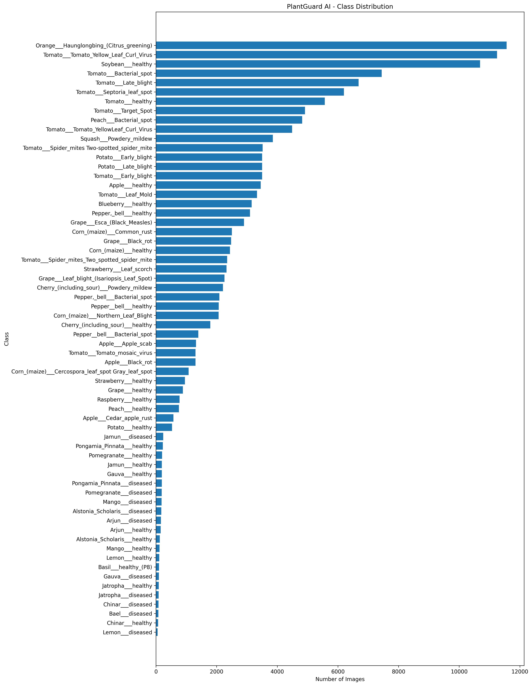
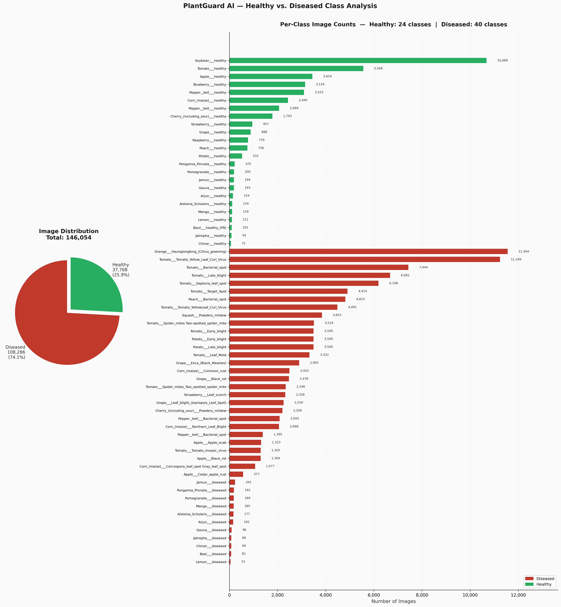
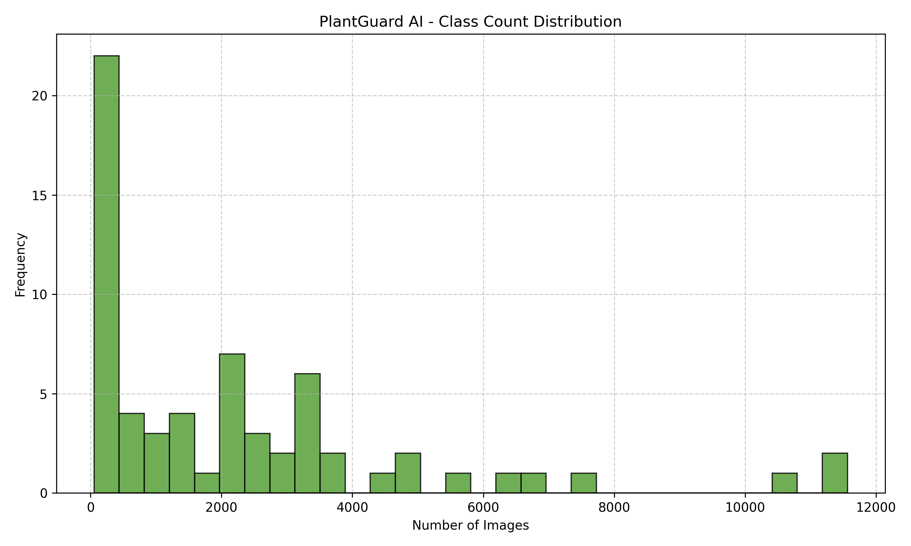
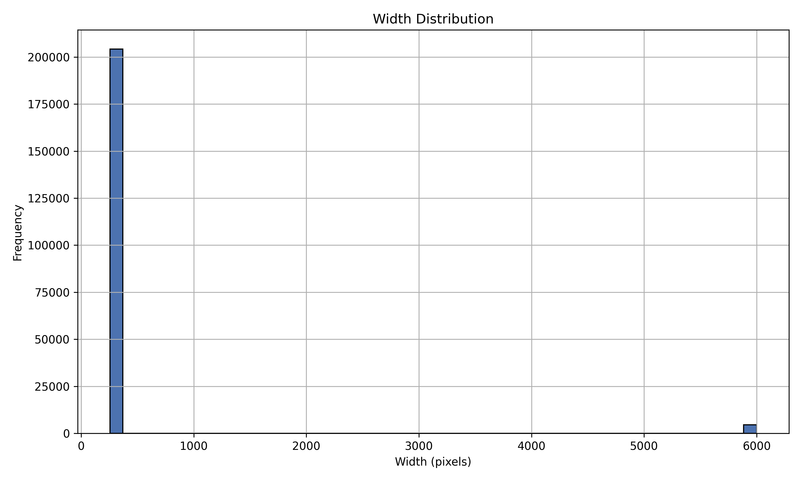
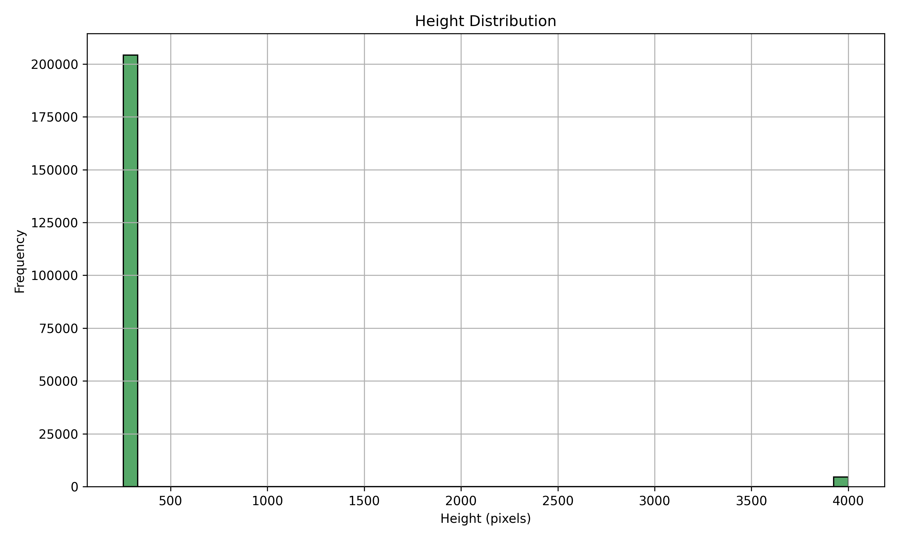
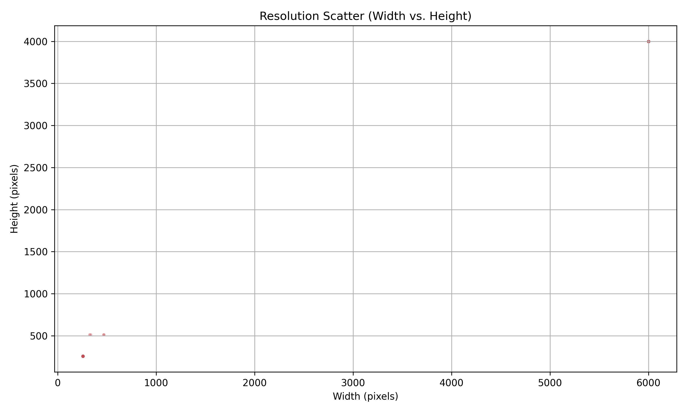

# Dataset Overview

The **PlantGuard AI** dataset is a comprehensive, multi-source agricultural computer vision corpus curated for plant disease detection and health status classification. It unifies images from multiple benchmark datasets into a single standardized taxonomy.

### Key Metrics Summary

| Metric | Value |
|---|---|
| **Total Full Corpus Images** | 208,686 |
| **Train Split Images** | 146,054 |
| **Total Canonical Classes** | 64 |
| **Source Datasets Aggregated** | 3 (`plantvillage_extra` (162,916 images), `PlantVillage` (41,276 images), `Plantleaves` (4,502 images)) |
| **Corrupted / Invalid Images** | 0 (100% Valid) |
| **Dominant Image Resolution** | 256×256 px |
| **Data Quality Assurance** | Clean & Verified ✅ |

---

# Distribution Analysis

The dataset spans **64 classes** across various plant species and pathological conditions. Class sample counts exhibit significant variance across the dataset.

### Class Size Distribution Metrics

- **Mean Class Size:** `2,282.09` images per class
- **Median Class Size:** `1,359.00` images per class
- **Standard Deviation:** `2,704.99` images
- **Coefficient of Variation (CV):** `118.53%` (indicates high dispersion)

*Figure 1: Full class distribution sorted by image count across all 64 classes.*

---

# Healthy vs Diseased Analysis

A critical dimension of agricultural AI models is distinguishing healthy foliage from diseased leaves. The dataset classes are split based on health status keywords.

### Health Category Breakdown

| Category | Class Count | Class % | Total Images | Image % |
|---|---:|---:|---:|---:|
| **Healthy** | 24 | 37.50% | 37,768 | 25.86% |
| **Diseased** | 40 | 62.50% | 108,286 | 74.14% |
| **Total** | **64** | **100.00%** | **146,054** | **100.00%** |

Diseased samples represent the vast majority (**74.1%** of images across **40 classes**), reflecting the broad spectrum of plant pathologies (fungal, bacterial, viral, and pest-induced) covered in the corpus.

*Figure 2: Proportional distribution of healthy versus diseased classes and total image counts.*

---

# Class Imbalance Analysis

Class imbalance represents one of the primary technical challenges in training a high-performing classifier on PlantGuard AI.

### Imbalance Summary

- **Imbalance Ratio:** **`218.19x`** (`Largest Count / Smallest Count`)
- **Imbalance Severity Level:** **`Critical`** ⚠️
- **Largest Class:** `Orange___Haunglongbing_(Citrus_greening)` (**11,564** images)
- **Smallest Class:** `Lemon___diseased` (**53** images)
- **Minority Classes (≤500 images):** **22** classes
- **Majority Classes (≥5000 images):** **7** classes

*Figure 3: Class count distribution histogram highlighting minority and majority class boundaries.*

---

# Resolution Analysis

Analyzing image dimensions and aspect ratios is essential to determine optimal model input resolution and cropping/scaling transformations without introducing distortion or loss of critical visual symptoms.

### Spatial Dimension Statistics

| Dimension | Min | Max | Mean | Median | Std Dev |
|---|---:|---:|---:|---:|---:|
| **Width (px)** | 256.0 | 6000.0 | 379.70 | **256.0** | 833.79 |
| **Height (px)** | 256.0 | 4000.0 | 336.63 | **256.0** | 543.48 |
| **Aspect Ratio** | 0.63 | 1.5 | **1.0100** | 1.0 | 0.07 |

### Key Resolution Findings

- **Dominant Aspect Ratio:** The mean aspect ratio is **`1.01`** (median `1.00`), indicating that the overwhelming majority of samples are square images.
- **Native Median Resolution:** The median image size is **`256×256`** pixels. Resizing to standard CNN input dimensions (`224×224`) requires only a minor downscale (≈`12.5%` reduction) with zero quality-degrading upscaling.

| Width Distribution | Height Distribution |
|---|---|
|  |  |

*Figure 4: Image Width vs. Height scatter plot highlighting the heavy concentration of 256×256 images.*

---

# Sample Visualization

A 5×5 sample grid was constructed by sampling across diverse classes to visually inspect image quality, background variability, leaf framing, and lighting conditions.

*Figure 5: 5×5 sample grid overview displaying representative images across healthy (green border) and diseased (red border) classes.*

---

# Key Findings

1. **High Dataset Quality:** **0 corrupted images** detected out of 208,686 files. All images are valid JPEG/PNG files.
2. **Extreme Class Imbalance:** Severe imbalance ratio of **`218.19x`** (`11,564` max vs. `53` min). Standard cross-entropy loss without re-weighting or oversampling will fail on minority classes.
3. **Substantial Minority Class Presence:** **22 classes** have ≤500 samples in the training set. Targeted data augmentation and sampling are mandatory for these classes.
4. **Ideal Native Spatial Properties:** Median resolution of **`256×256`** and near-perfect **`1.00`** median aspect ratio make the dataset ideal for `224×224` transfer learning architectures (EfficientNet, ResNet, ViT).
5. **Pathology Dominance:** **76.98%** of images represent diseased leaves across **52 pathology classes**, providing rich diagnostic coverage for real-world deployment.

---

# Training Recommendations

Based on empirical EDA metrics, the following configuration guidelines are recommended for Phase 5 (Model Training):

### 1. Training Pipeline Configuration

| Priority | Category | Recommendation |
|---|---|---|
| **Critical** | **Loss Function** | Use Focal Loss (gamma=2, alpha tuned per class) instead of standard cross-entropy. Imbalance ratio is 218.2x — standard CE will over-fit to majority classes. |
| **High** | **Sampling** | 22 minority classes (≤500 images) detected. Use WeightedRandomSampler in PyTorch DataLoader to oversample minority classes during training. |
| **Medium** | **Training Duration** | Dataset has 146,054 training images. Start with 30–50 epochs and use early stopping (patience=5) to avoid over-training. |
| **Medium** | **Learning Rate** | Use CosineAnnealingLR or OneCycleLR scheduler. Initial LR: 1e-3 (scratch) or 1e-4 (fine-tuning pretrained). Warm-up for 3–5 epochs. |
| **Medium** | **Batch Size** | Batch size 32 is recommended for 224×224 inputs on a single GPU. Increase to 64 if GPU VRAM ≥ 16 GB. Use gradient accumulation if VRAM is limited. |
| **Low** | **Compute Efficiency** | Enable AMP (torch.cuda.amp.autocast) for ~2× training speed-up on NVIDIA GPUs with Tensor Cores (Volta+). |
| **Low** | **Validation** | Validate every epoch. Track macro-averaged F1 and per-class recall alongside accuracy — accuracy is misleading under class imbalance. |

### 2. Class Weight Strategy

- **Formula:** `weight_c = N_total / (N_classes × N_c)` (sklearn `balanced` mode)
- **Recommended Loss:** `Focal Loss (gamma=2) with per-class alpha weights derived from inverse frequency.`
- **Expected Weight Range:** `0.1973` to `43.0584` (Ratio: `218.24x`)

### 3. Data Augmentation Strategy

- **Minority Target:** Augment all 37.7x minority classes up to **`~2000`** images.
- **Train Transforms:**
  - `RandomHorizontalFlip(p=0.5)` & `RandomVerticalFlip(p=0.5)`
  - `RandomRotation(degrees=30)` & `RandomAffine(translate=(0.1, 0.1))`
  - `ColorJitter(brightness=0.3, contrast=0.3, saturation=0.3)`
  - `RandomResizedCrop(224, scale=(0.8, 1.0))`
  - `Normalize(mean=[0.2297, 0.2633, 0.2349], std=[0.1375, 0.1606, 0.1249])`

### 4. Input Size Selection

- **Primary Input Size:** **`224×224`** (Optimal efficiency & ImageNet pre-training alignment)
- **Secondary Input Size:** **`256×256`** (Zero-downscale option for high-capacity models)

### 5. Model Architecture Selection

| Rank | Model | Type | Input Size | Parameters | Recommended |
|---|---|---|---|---|---|
| #1 | **EfficientNet-B0** | Transfer Learning (ImageNet) | 224×224 | 5.3M | ✅ Yes |
| #2 | **ResNet-50** | Transfer Learning (ImageNet) | 224×224 | 25.6M | ✅ Yes |
| #3 | **ViT-B/16** | Vision Transformer (ImageNet-21k) | 224×224 | 86.6M | ✅ Yes |
| #4 | **Custom CNN (Baseline)** | Trained from scratch | 224×224 | ~2–5M | Baseline |

---

# Next Steps (Phase 5)

With Phase 4 EDA completed and technical recommendations established, the immediate roadmap for Phase 5 (Model Training & Evaluation) is:

1. **Complete Training Pipeline Stubs (`ai/` directory):**
   - Implement `ai/configs/config.py` with `TrainingConfig` dataclass.
   - Implement `ai/data/dataset.py` with `PlantGuardDataset`.
   - Implement `ai/data/augmentation.py` with Albumentations / Torchvision pipelines.
   - Implement `ai/data/preprocessing.py` with `get_dataloaders()` and `WeightedRandomSampler`.
2. **Persist Class Weights Metadata:**
   - Execute `scripts/analysis/compute_class_weights.py` to generate `datasets/metadata/class_weights.json`.
3. **Train Baseline EfficientNet-B0 Model:**
   - Train primary model using Focal Loss / Weighted Cross-Entropy and PyTorch AMP.
   - Track macro-averaged F1, top-1 accuracy, and per-class recall.
4. **Benchmark Additional Architectures:**
   - Train ResNet-50 and ViT-B/16 for comparative evaluation.
5. **Proceed to Explainability & Severity Assessment (Phases 7 & 8):**
   - Integrate Grad-CAM explainability heatmaps for model interpretability.

---
*Report automatically generated by PlantGuard AI Engineering Pipeline.*
